.. _admin_console:

.. index::
   single: Admin Console

***************************************************
Entando Admin Console Overview
***************************************************

The purpose of this document is to describe the elements and
functionalities provided by the Entando Admin Console. 
The Admin Console includes tools to manage administrative core features and WCMS functionality.

Entando Admin Console Version 4.3.1
=====================================

With Entando version 4.3.1 the Admin Console has been redesigned and
renewed with the adoption of the PatternFly framework and guidelines.

PatternFly is built on top of Bootstrap3, it provides an enterprise
grade UX look and feel based on research and UX best practices.

Admin Console
=====================================

The Entando main view is the entry point for every administration
activity. It is divided into two distinct areas. On the left-hand side
of the screen there is a tabbed menu, which gives access to all
Entando’s functionalities, while on the right hand-side of the screen,
the Dashboard provides an overview of Entando status and a quick access
to some functionalities( 
:ref:`figure1`).

.. _figure1:
.. figure:: media/image4.png
   :scale: 75 %
   :alt: Main View
   :align: center
   
   *Figure 1: Main View*

.. index::
   single: Dashboard

Dashboard
---------

The dashboard, see 
:ref:`figure2` below, is divided into areas, those areas
are:

-  Page Status (gives an overview of the status of the pages: Online,
   Online /= Draft and Draft)

-  Content Status (gives an overview of the content’s status: Approved,
   Work, Approved with changes)

-  Page List (list of all pages: Description, Status, Last Modified)

-  Content List (list of contents: Description, Author, Type, Status,
   Last Modified)

-  Fast Settings

-  Users List (quick access to Users list)

-  Categories (quick access to categories)

-  Labels & Languages (quick access to labels and languages)

-  Reload Config (quick access to reload configuration functionality)

-  Add Content (quick access to adding content functionalities)

-  Add Asset (quick access to adding assets functionalities)

-  Add User (quick access to add user functionalities)

.. _figure2:
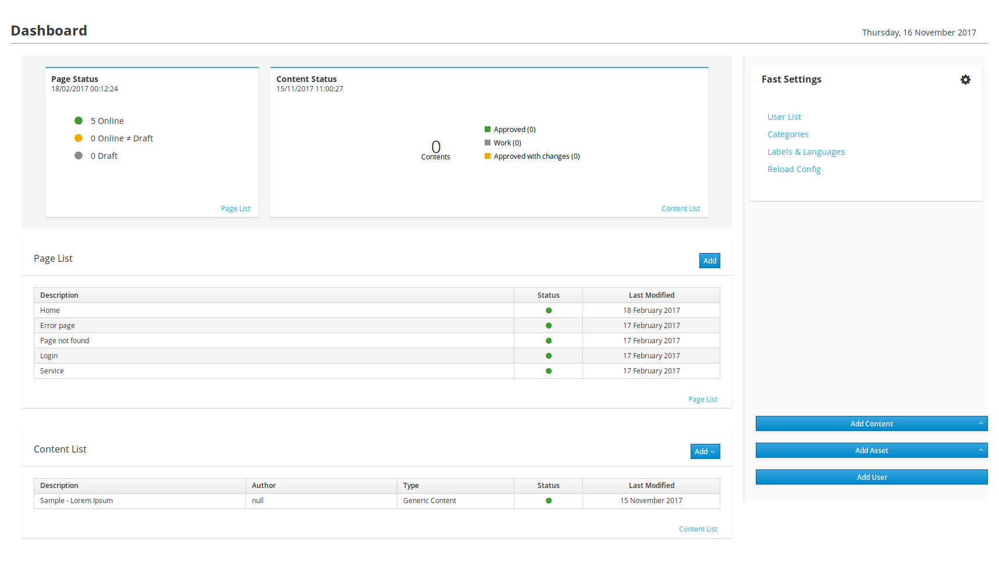
   
   *Figure 2: Dashboard*

.. index::
   single: Menu

Menu
----

The tools panel is a tabbed menu from which you can access every
Entando’s elements. It is divided in main sections (refer to the next
section called “Main Sections” for more details).

.. _figure3:
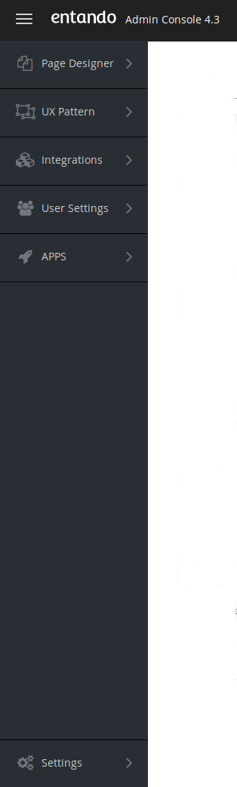
   
   *Figure 3: Menu*

.. index::
   single: Admin Console Sections

Admin Console Main Sections
=====================================

The Admin Console is made up of different sections, generally further
divided in subsections; each one of them is accessible from a tabbed
menu on the left-hand side of the screen (see picture below)

Every section provides specific functionalities.

The main sections are:

-  :ref:`page_designer` 

-  :ref:`ux_pattern`

-  :ref:`integrations`

-  :ref:`user_settings`

-  :ref:`apps`

-  :ref:`settings`

The next paragraphs provide more details for every menu section.

.. index::
   single: Page Designer

.. _page_designer:

Page designer
--------------------------------

The Page Designer section, deals with all page management related
activities, it is made up of three subsections as shown below, (
:ref:`figure4`).

-  Page Designer

   -  Page Tree

   -  Page Configuration

   -  Page Settings

.. _figure4:
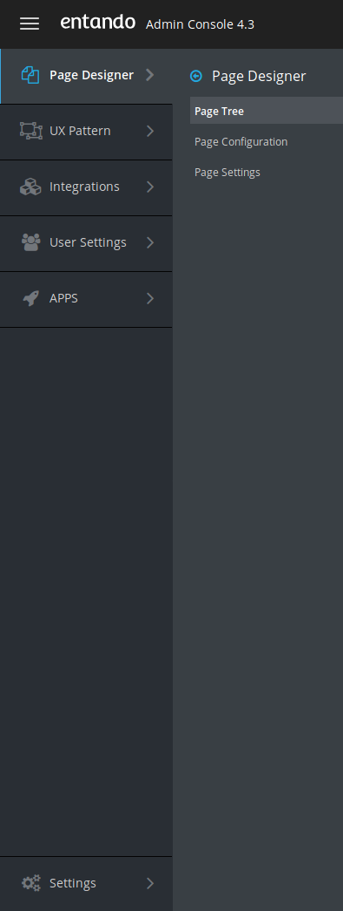

	 
   
   *Figure 4: Page Designer Menu*

.. index::
   single: Page Tree

Page Tree
^^^^^^^^^^

The Page Tree subsection shows the hierarchical structure of the pages,
its status, and let you perform all actions needed to manage them, such
as adding a new page, edit, configure, detail, clone, publish or
unpublish pages (see
:ref:`figure5`).

.. _figure5:
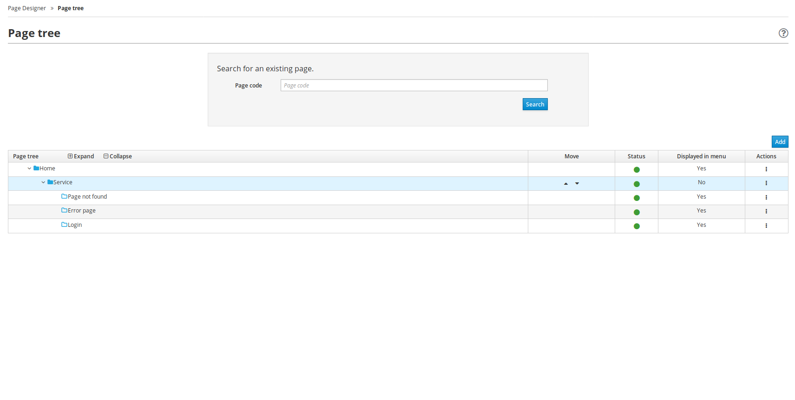
   
   *Figure 5: Page Tree*

Pages's Actions
~~~~~~~~~~~~~~~~

For every page present, in the Page Tree, you have access to a set of
actions, (see 
:ref:`figure6`), through the kebab menu (three dots menu), from which you can:

-  Add (add a new page hierarchical dependent from that page)

-  Edit (change the parameters that define a page)

-  Configure (change the widgets associated with the frames in the page)

-  Details (get general information on the page: Name, Code, Type)

-  Clone (replicate the page)

-  Delete (remove the page)

-  Publish/Unpublish (making visible/invisible the page)

.. _figure6:
.. figure:: media/image9.png
   :scale: 75 %
   :alt: Page Tree
   :align: center
   
   *Figure 6: Page Actions*

**Add a new page**

This functionality can be accessed from the Page tree view, (see 
:ref:`figure7`), through the Add button; in that case you need to select its
hierarchical placement afterwards. Another way to add a new page is to
select the Add action, for a page, from its kebab menu; in this case
your new page will be a daughter of the selected page.

A page must have a title, a code, a placement, an owner group, a join
group and a page model.

Please refer to
:ref:`add-new-page` for details.

.. _figure7:
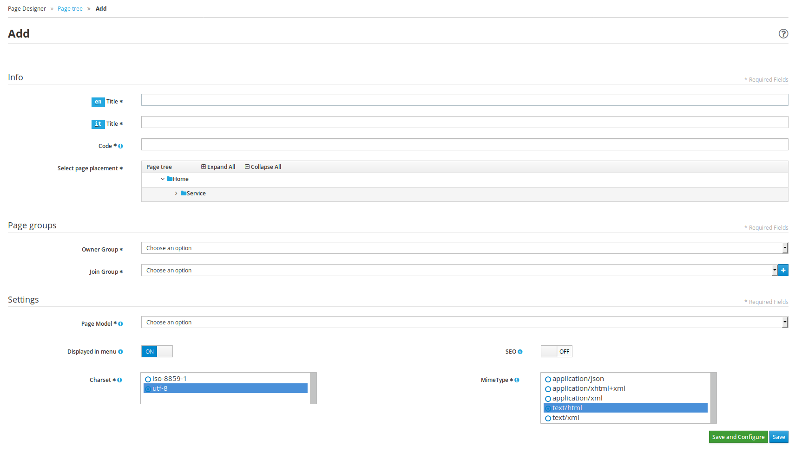
   
   *Figure 7: Add a Page*

**Edit a page**

This action refers to an already present page. The edit page view is
divided into sections (
:ref:`figure8`):

-  Info

-  Title (title of the page, mandatory)

-  Code (code of the page, assigned automatically, not changeable)

-  Page groups

   -  Owner Group (owner of the page, assigned at creation time, and not
      changeable)

   -  Join Group (group to join, selectable from a drop-down list of
      available groups)

-  Settings

   -  Page Model (the model of the page, mandatory)

   -  Displayed in menu (set whether it must be displayed in menu or
      not, settable to On or Off)

   -  SEO (Search Engine Optimization, set whether it must be optimized
      for Search Engine, settable to On or Off)

   -  Charset (selectable between available charset, i.e. utf8,
      iso-88591)

   -  Mime Type (identifies the type of information, namely text/html,
      application/JSON, and so forth)

.. _figure8:
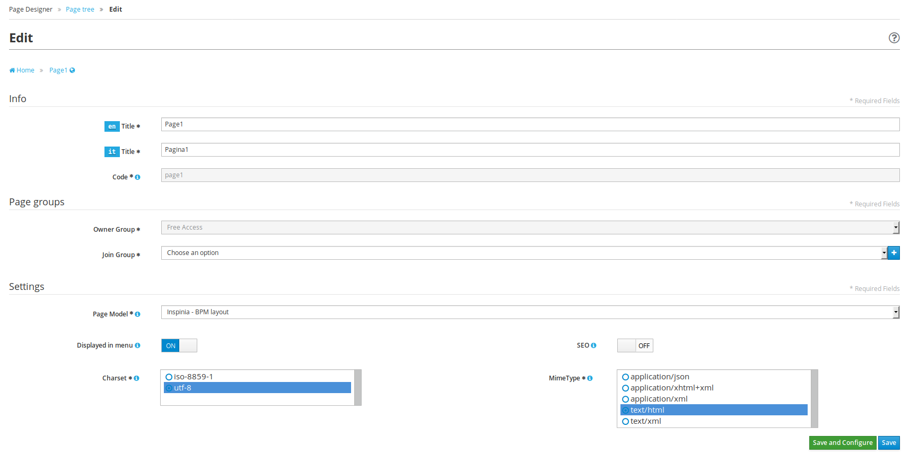
   
   *Figure 8: Edit a Page*

**Configure a page**

In the page configuration section, you can assign available widgets to
the frames in the page. The page model defines the available frames or
in other words the page’s layout. The available Widgets are listed from
a Widgets list on the right-hand side of the screen. You can drag
widgets and drop them in a frame of your choice, how it’s showed in the
:ref:`figure9` and 
:ref:`figure10`.

You can also publish or unpublish the page or show its preview.

.. _figure9:
.. figure:: media/image12.png
   :scale: 75 %
   :alt: Frames in a page
   :align: center
   
   *Figure 9: Frames in a page*

.. _figure10:
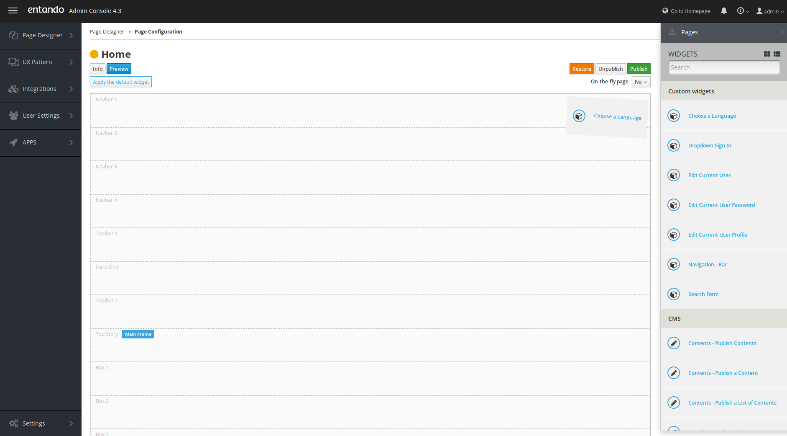
   
   *Figure 10: Drag and Drop Widgets to Frames*

**Details**

This section shows the hierarchical placement of the page, along with
the list of the contents present, and any contents that are linked to
the current page.

**Clone**

The clone action clones the page with its structure and content, and
makes the cloned page a daughter.

**Delete**

This action removes the page; please note that pages with dependent
pages cannot be deleted.

**Publish/Unpublish**

This action let you publish the page if unpublished or unpublish if it
is published.

Page Configuration
^^^^^^^^^^^^^^^^^^

Page Configuration subsection, gives you immediate access to homepage
configuration.

Page Settings
^^^^^^^^^^^^^^^^^^

Page Settings subsection, gives you immediate access to general settings
such as: Home Page, Page not found, Page for generic error and so on,
(see 
:ref:`figure11`).

.. _figure11:
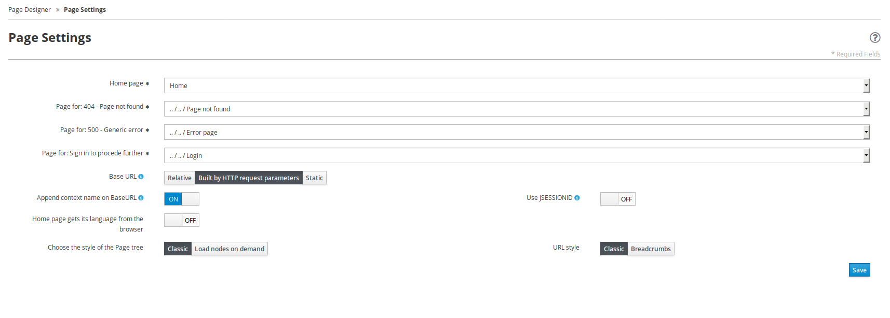
   
   *Figure 11: Page Settings*

.. index::
   single: UX Pattern

.. _ux_pattern:

UX Pattern
--------------------------------

The **UX Pattern** section is made up of three subsections and it’s the
place where general UX Pattern settings are set.

-  UX Pattern

    - Widget (entry point for widgets management)
 
    - Fragments

    - Page Models

.. _figure12:
.. figure:: media/image15.png
   :scale: 75 %
   :alt: UX Pattern
   :align: center
   
   *Figure 12: UX Pattern*

.. index::
   single: Widgets

Widgets
^^^^^^^^^^^^^^^^^^

A Widget is an independent software component configured and executed
within your application’s Page to build UX/UI blocks, which provides a
specific functionality.

This section shows a list of all available Widgets grouped in various
types (see
:ref:`figure13`):

- User Widgets (user-generated widgets, made from the Admin Console)

- Custom Widgets (widgets designed to meet specific applications needs)

- Stock Widgets (widgets provided by Entando to implement general, common functionalities)

- Specific Application Widgets, for example if the CMS module is installed it provides Content Management related widgets.

- Plugins widgets (widgets provided by the installed plugins)

For every Widget the list shows:

- Widget name

- Widget code

- Number of pages using the widget

Actions menu, the available actions depend on the widget, and could be:

- Info

- Add widget

- Add Service (if the widget provides a service)

Note that some Widgets could have no action associated too.

An add button is also present for adding new user-defined Widgets.

.. _figure13:
.. figure:: media/image16.png
   :scale: 75 %
   :alt: Widgets List
   :align: center
   
   *Figure 13: Widgets List*

.. index::
   single: Fragments

Fragments
^^^^^^^^^^^^^^^^^^

Fragments are HTML blocks that include Freemarker [1]_ instructions by
using specific tags that should be replaced by suitable values each time
the fragment is used.

Widgets are rendered using the *Entando Fragments.*

From this subsection, you get access to a list of all available
fragments, (
:ref:`figure14`), a search functionality is also available.

The Fragments list shows in tabled format:

-  Code

-  Widget type

-  Plugin

-  Actions

An Add button let you add a new Fragment.

.. _figure14:
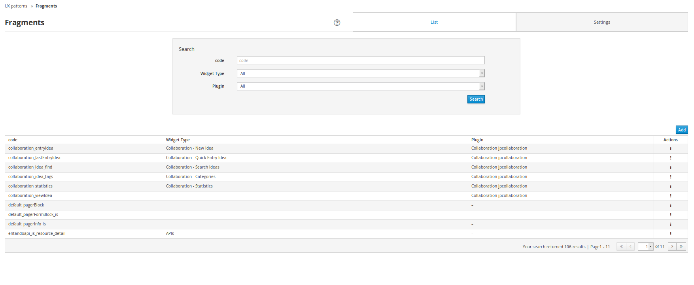
   
   *Figure 14: Fragments*

**Add new fragments**

In adding a new Fragment, (see 
:ref:`figure15`), the following parameters
are mandatory:

-  Code

-  Gui Code (Freemarker formatted text)

.. _figure15:
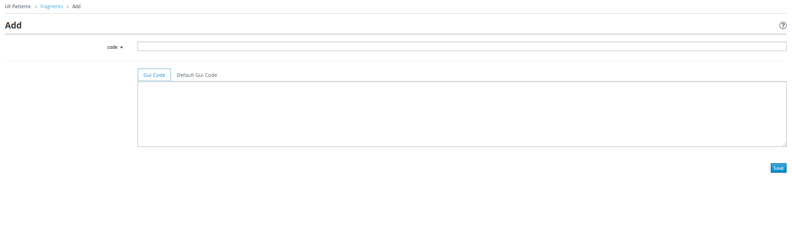
   
   *Figure 15: Add new Fragments*

.. index::
   single: Page Models

Page Models
^^^^^^^^^^^^^^^^^^

In the Page Models subsection, a list of available page models is
displayed, (
:ref:`figure16`). Each Page Model has action associated with it:

-  Edit (gives access to the page model editing view, 
   :ref:`figure17`)

-  Details (shows details on the page model)

-  Delete (deletes the page model)

The Page Model is the design of an application's page. It’s s defined
through 2 configuration elements:

-  XML Configuration

-  Template

The **XML Configuration** is an XML formatted text in which we define
the frames list that will make up that model of the page. The basic tags
that must be present are <frames></frames> which collects all the frames
and <frame></frame> which defines the frame with some specific values
for the frame specific defined properties.

The **Template** represents the look and feel and the real layout of the
page. It’s based on Velocity template script.

The Velocity Template Language (VTL) is meant to provide an easy, simple
and clean way to incorporate dynamic content in a web page; it’s
powerful and easy at the same time; it supports statements and
directives, references and comments, access to exposed java objects and
methods.

The template defines the look and feel of the rendered page model. In
the template you define in which condition and how to show a given frame and also 
how it will be rendered.

At the bottom of the Page Model Edit view, the template is rendered for
previewing its structure based on the defined XML configuration.

.. _figure16:
.. figure:: media/image19.png
   :scale: 75 %
   :alt: Page Models List
   :align: center
   
   *Figure 16: Page Models List*

.. _figure17:
.. figure:: media/image20.png
   :scale: 75 %
   :alt: Page Model Edit
   :align: center
   
   *Figure 17: Page Model Edit*

.. index::
   single: Integrations

.. _integrations:

Integrations 
--------------------------------

From this section it is possible to configure Entando’s integration with
other systems via REST based APIs and is made up of two subsections,
(see 
:ref:`figure18`):

-  Integrations

   -  Components

-  API Management

   -  Resources

   -  Services

   -  Consumer

.. _figure18:
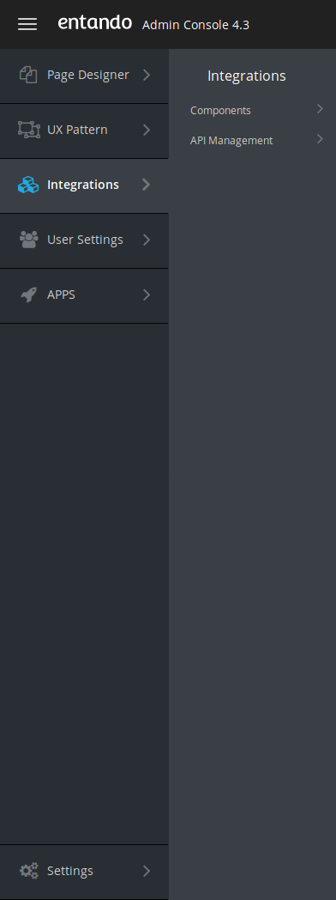
   
   *Figure 18: Integrations*

Components
^^^^^^^^^^^

From Components (Plugins) you get access to a list of all installed
components, (see 
:ref:`figure19`)

You can configure the particular component by clicking on its name, in
the menu.

The main setting you can change of a particular component is whether it
is active or not, other available settings are dependable from the
particular component features, the 
:ref:`figure20`, shows, an example of the
parameters for the “LDAP connector”

.. _figure19:
.. figure:: media/image22.png
   :scale: 75 %
   :alt: Components
   :align: center
   
   *Figure 19: Components*

.. _figure20:
.. figure:: media/image23.png
   :scale: 75 %
   :alt: Component Configuration Example
   :align: center
   
   *Figure 20: Component Configuration Example*

API Management
^^^^^^^^^^^^^^^

From this sub-section, (see
:ref:`figure21`), it is possible to manage and
configure the Entando API integration.

-  API Management

   -  Resources

   -  Services

   -  Consumer

.. _figure21:
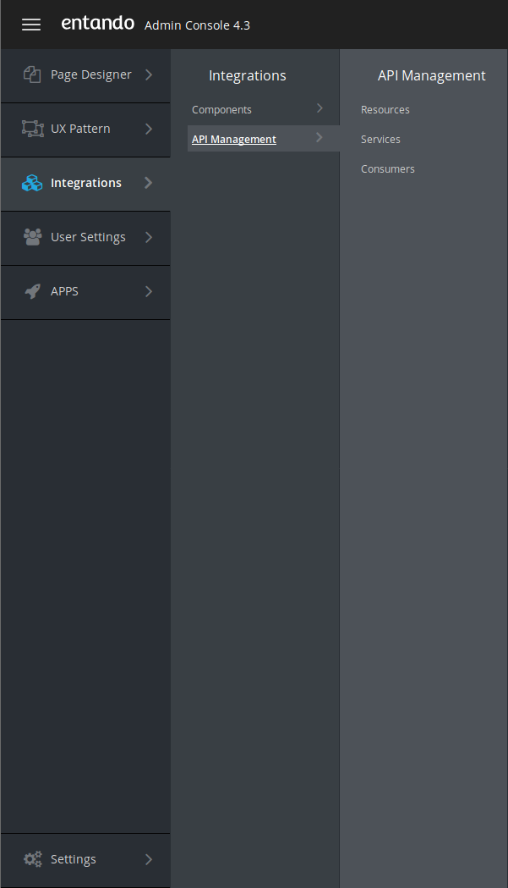

   *Figure 21: API Management*

Resources
~~~~~~~~~~

This section provides a list of all available API resources, collected
in groups such as: Core, CMS, Custom API’s, (
:ref:`figure22`).

They are presented in a table with the following columns:

-  Resources

-  Name

-  List of HTTP methods for RESTful services for that resource:

   -  GET

   -  POST

   -  PUT

   -  DELETE

.. _figure22:
.. figure:: media/image25.png
   :scale: 75 %
   :alt: API Resources List
   :align: center
   
   *Figure 22: API Resources List*

**Edit resource configuration**

By clicking on the resource’s name, you can edit that resource
configuration (
:ref:`figure23`).

The screen is divided into several areas:

-  Information, presents information on the resource, and in particular:

   -  Name (name of the resource)

   -  Namespace (its namespace i.e. /core)

   -  Description (description of the resource)

   -  Source (source of the resource, i.e. core)

   -  Plugins (the plugin to which the resource refers, if available)

   -  Resource URI (URI of the resource)

   -  Extension (XML, JSON extensions)

-  All methods options, from which can be set globally, for all defined
   methods, the following parameters

   -  Active (set active ON/OFF)

   -  Hidden (set hidden ON/OFF)

   -  Authorization (set authorization for the resource from a drop-down
      list)

Settings for single methods, which are GET, POST, PUT, DELETE.

-  GET: this area let you view and set parameters for only the GET
   method; it has an informative section, in which are presented the
   following parameters:

   -  Method (Available/Active)

   -  Description (Description of the method)

   -  Visibility

   -  Authorization

   -  XML schemas

   -  Request parameters

   -  Active

   -  Hidden

   -  Authorization

-  POST: provides the same view of GET, but referred to the POST method

-  PUT: provides the same view of GET, but referred to the PUT method

-  DELETE: provides the same view of GET, but referred to the DELETE
   method

Single method’s settings can also be accessed from the main API resource
screen, by clicking on the method’s icon.

.. _figure23:
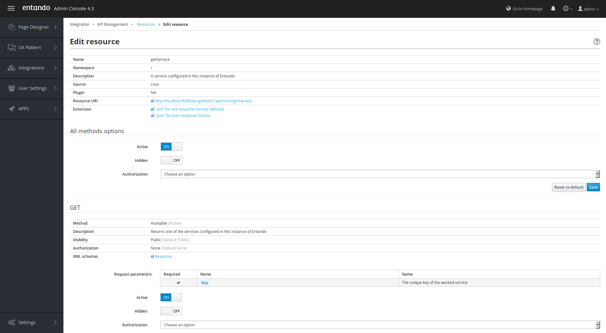
   
   *Figure 23: API Edit Resource Configuration*

.. index::
   single: Services

Services
~~~~~~~~~~~~~~

From this subsection you can list the API services available in the
system or add a new one.

The list presents, (see
:ref:`figure24`) in a table, grouped by API service
type, the following parameters:

-  Service

-  Name

-  Active

-  Public

-  Delete (deletes the API service)

.. _figure24:
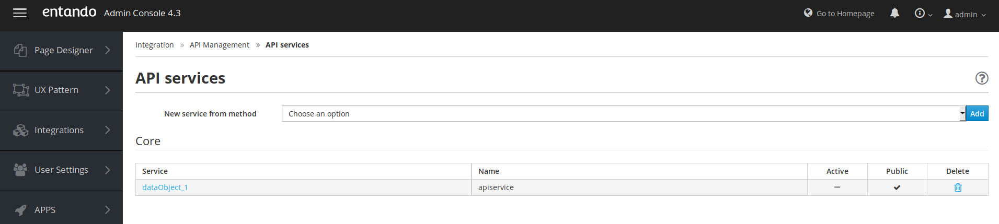
   
   *Figure 24: API Services List*

By clicking on the service, you can edit its settings, (see 
:ref:`figure25`), which are grouped into:

-  Info

-  Name (name of the service)

-  Tag (tags for the service)

Options:

-  Active (active ON/OFF)

-  Hidden (hidden ON/OFF)

Authorization, sets authorizations on the service, in particular:

-  Registered users (ON/OFF)

-  Registered users with permission (sets the user’s permission on the
   resource, from a drop-down list of available options)

-  Registered users belonging to the group (set permissions to all users
   belonging to a group, selectable from a drop-down list)

**Parameters**

The table lists all the parameters which characterize that API service
with the following columns:

-  Name (name of the parameter)

-  Description

-  Required

-  Default

-  Can be overridden

.. _figure25:
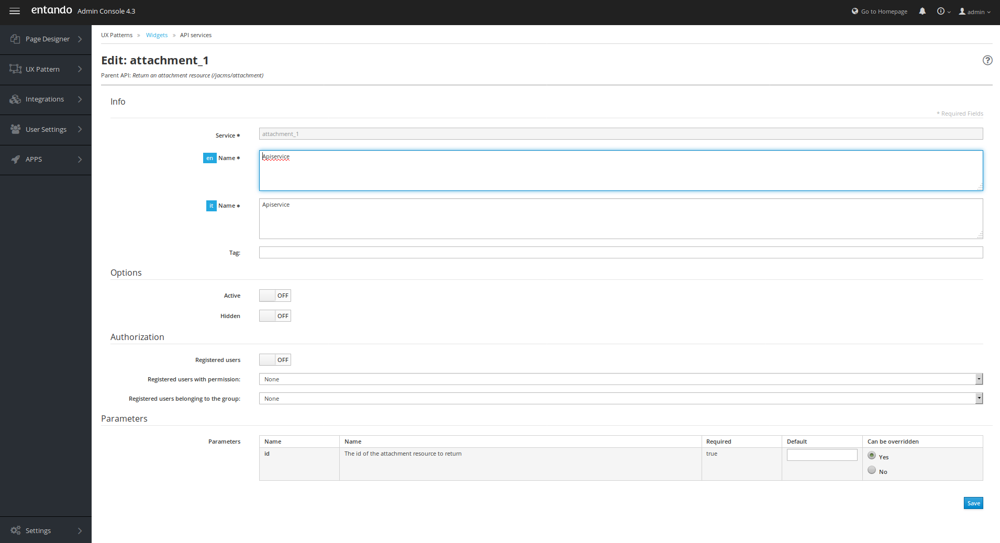
   
   *Figure 25: Edit API Service*

**Create a new API Service**

In creating a new API service you need to select, from the list of
available methods, which new service will be based on, i.e. its master
method.

The new API service will inherit from the master method its defining
parameters (see 
:ref:`figure26`).

You will need to provide values to the following parameters; only some
of them are mandatory.

-  Info

   -  Name (mandatory)

   -  Tag

-  Options

   -  Active

   -  Hidden

-  Authorization

   -  Registered users

   -  Registered users with permission

   -  Registered users belonging to the group

-  Parameters

   -  Default

   -  Can be overridden

.. _figure26:
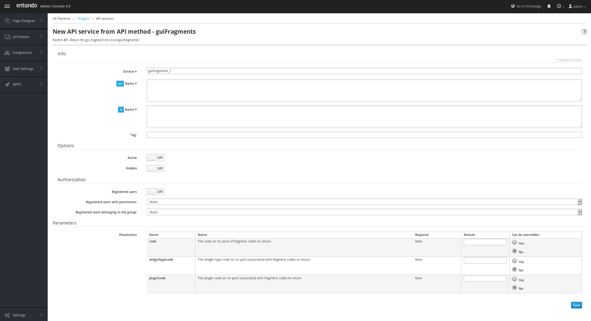
   
   *Figure 26: New API Service from API Method*

Consumers
~~~~~~~~~~~~~~

It let you manage the authorization of consumers to communicate with
providers for authentication. It is based on OAUTH1.

This view (
:ref:`figure27`) shows a list of all defined API consumers
and presents -in a table format- the following parameters:

-  Key

-  Name

-  Number of tokens

-  Actions

   -  Edit (edit the consumer parameters)

      -  Key

      -  Secret

      -  Name

      -  Expiration date

   -  Delete (deletes the consumer)

.. _figure27:
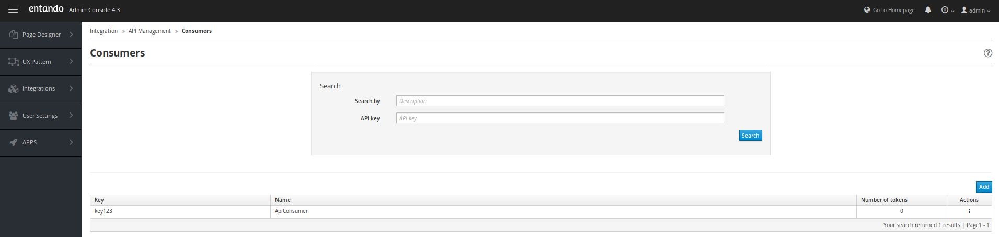
   
   *Figure 27: API Consumers List*

**Edit an** **API Consumer**

The editing functionality for the API Consumer is available from the
kebab menu, from this view it is possible to change the defining
parameters of the Consumer (see 
:ref:`figure28`).

.. _figure28:
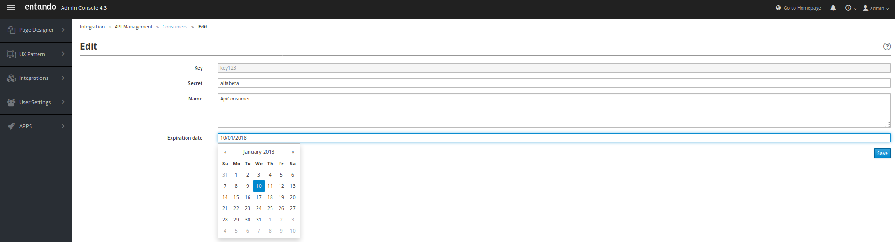
   
   *Figure 28: API Consumer Edit*

.. _user_settings:

User Settings
--------------------------------

The **User Settings** section, (see 
:ref:`figure29`), is the place from where 
all user management related activities can be performed and it is made up of subsections
as shown below.

-  User Settings

   -  Users

   -  Profile Types

   -  User Restriction

   -  Roles

An Add button is also present, which let you add a new user.

.. _figure29:
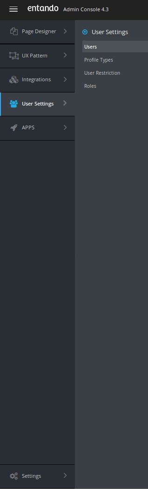
   
   *Figure 29: Users Settings*

Users
^^^^^^

Viewing a list of all users defined in the system is possible under the User subsection (
:ref:`figure30`).

For every single user in the list it is shown:

-  Username

-  Full name

-  Email

-  Status

-  Actions menu

   -  Edit

   -  Manage authorizations

   -  Edit the profile of

   -  View the profile of

   -  Delete

.. _figure30:
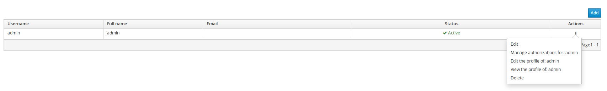
   
   *Figure 30: Users List and Actions*

The Edit functionality (
:ref:`figure31`) let you change:

-  Password

-  User status to ON or OFF

.. _figure31:
.. figure:: media/image34.png
   :scale: 75 %
   :alt: Edit User
   :align: center
   
   *Figure 31: Edit User*

Manage Authorizations (
:ref:`figure32`) let you change:

-  Authorizations for the user:

   -  User Group

   -  User Role

Refer to
:ref:`user-authorizations`
for details.

.. _figure32:
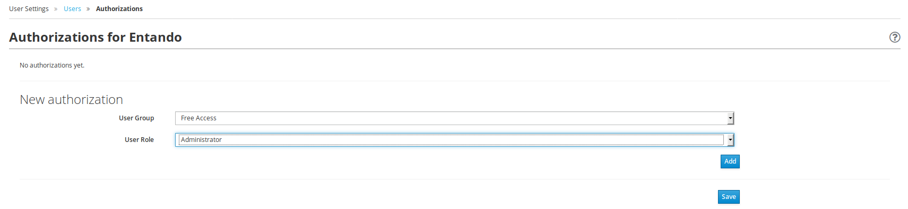
   
   *Figure 32: User Authorizations*

From the Edit Profile action (
:ref:`figure33`) you change the
attributes defined in the profile type:

-  Full Name

-  E-mail address

-  Profile Type (change user’s profile type)

.. _figure33:
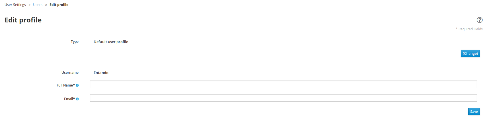
   
   *Figure 33: Edit Profile of a User*

The View Profile action (
:ref:`figure34`) let you view, for the selected
user, its profile parameters. In this case the user profile parameters
are:

-  Full Name

-  E-mail address

Please, note that the real parameters depend on which user profile users
instantiate.

.. _figure34:
.. figure:: media/image37.png
   :scale: 75 %
   :alt: User Profile Details
   :align: center
   
   *Figure 34: User Profile Details*

**Add a new user to Entando**.

Refer also to 
:ref:`add-new-user`
for details.

Adding a new user to the system, (see 
:ref:`figure35`), can be performed by
clicking on the Add button; you need to provide:

-  Username (the name used to log in into Entando)

-  Password (the user’s password needed to log in into Entando)

-  Confirm Password

-  Profile Type by selecting one from the drop-down list of the defined
   profile types.

A default user profile is always present in the list, as it is needed to
define the Admin’s user profile.

.. _figure35:
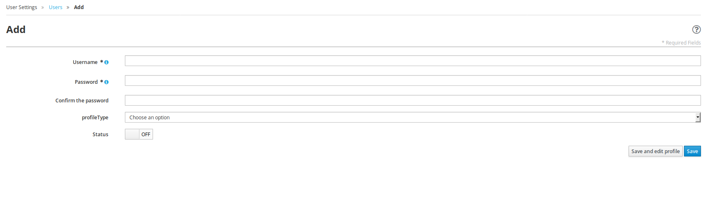
   
   *Figure 35: Add User*

Profile Types
^^^^^^^^^^^^^^

From the Profile Types, (see 
:ref:`figure36`), you can manage the different
user’s profiles defined in Entando or add a new User Profile.

That subsection lists all available Profile Types showing for each one:

-  Name

-  Code

-  Status

-  Actions menu

   -  Edit

   -  Reload

   -  Delete

(see 
:ref:`figure37`)

.. _figure36:
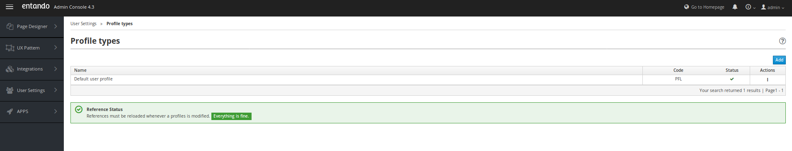
   
   *Figure 36:User Profile Types List*

.. _figure37:
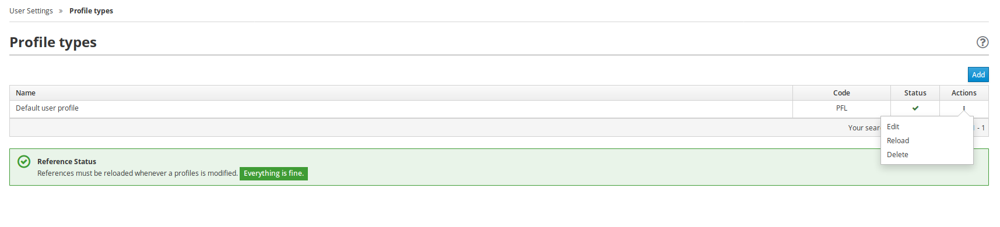
   
   *Figure 37: Users Profile Types Actions*

From **Edit** you can change the name of the profile type, and change
the set of attributes, which define that profile type.

The attributes have:

-  Code

-  Type

-  Roles

-  Mandatory

-  Filter

-  Actions

   -  Reload (makes changes effective, reloading the profile type)

   -  Delete (deletes the profile type)

**Add a new profile type**

When adding, (see 
:ref:`figure38`), a new profile type you will need to
provide:

-  Code

-  Name

-  Attributes

.. _figure38:
.. figure:: media/image41.png
   :scale: 75 %
   :alt: Add User Profile
   :align: center
   
   *Figure 38: Add User Profile*

Let’s say that a profile type describes the structure of a profile,
defining what parameters characterize the profile, that is done
assigning to that profile type, some attributes.

.. index::
   single: User Restriction

User Restrictions
^^^^^^^^^^^^^^^^^^^

From the User Restrictions subsection, (see 
:ref:`figure39`) you can
activate and set access restrictions on the user, imposing:

-  months availability since the last access

-  months validity of the user password

Selecting “Password always active” to both means no access limitation on
the user.

You can also enable: Enable Gravatar integration (Avatar of users)

.. _figure39:
.. figure:: media/image42.png
   :scale: 75 %
   :alt: User Restrictions
   :align: center
   
   *Figure 39: User Restrictions*

.. index::
   single: User Roles

Roles
^^^^^^^^^^^^^^

Please also refer to
:ref:`add-user-roles`
for additional information.

This subsection shows a list of all available roles, (see 
:ref:`figure40`),
for every role it is shown:

-  Name

-  Code

-  Actions Menu

An add button is also present to add new roles.

.. _figure40:
.. figure:: media/image43.png
   :scale: 75 %
   :alt: Users Roles
   :align: center
   
   *Figure 40: Users Roles*

**Adding a new role**

Please also refer to
:ref:`add-user-roles`
for additional information.

A role is a set of permissions. Users with a role inherit the permissions defined in the role. (see 
:ref:`figure41`).

In adding a new role, you need to provide:

-  Name (limitations on names)

-  Code (limitations on code)

-  Permissions

Preset permissions are:

-  Content Editing

-  User Profile Editing

-  User Editing

-  Access to Administration Area

-  Operations on Categories

-  Operations on Pages

-  Operations on Resources

-  View Users and Profiles

-  Supervision of Contents

-  All functions

.. _figure41:
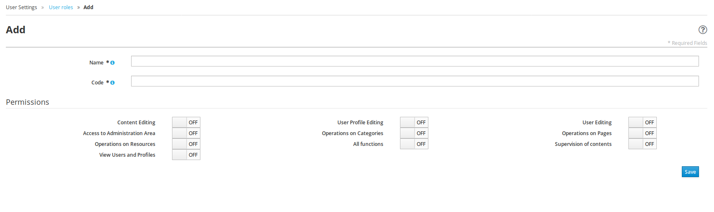
   
   *Figure 41: Add User Role*

**Action menu on roles**

Available actions are (see
:ref:`figure42`):

-  Details

-  Edit

-  Delete

.. _figure42:
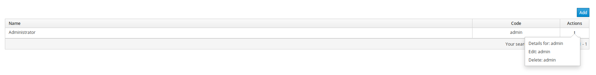
   
   *Figure 42: Actions on Roles*

From the details action (see 
:ref:`figure43`) you can get an overview of
that role in particular:

-  Group: (it is the group to which the role belongs)

-  Name: (name of the Role)

-  Permissions: permissions assigned to the role

-  Referenced users: list of users to which that role is applied, this
   list shows in a table the following parameters:

   -  Username

   -  Last login (date of the last login)

   -  Status (active or not)

   -  Actions: edit and manage authorizations for (let you manage
      authorizations for the user)

.. _figure43:
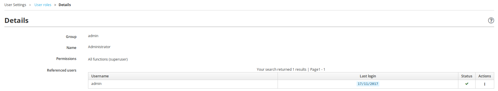
   
   *Figure 43: User Roles Details*

.. _apps:

APPS
--------------------------------

APPS section shows all the applications installed in the system as
plugins, (see 
:ref:`figure44`). A common application is the CMS (Content
Management System), and it is installed by default.

-  APPS

   -  CMS

   -  IoT

.. _figure44:
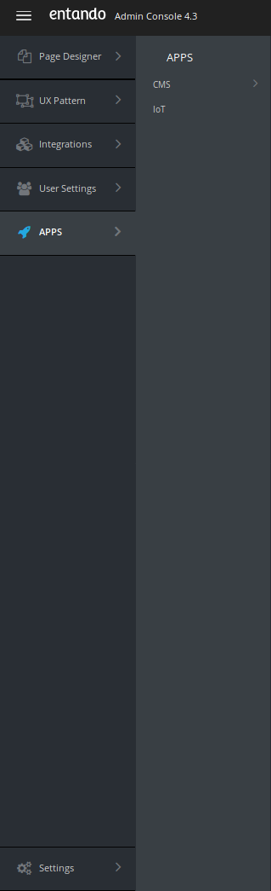
   
   *Figure 44: APPS Menu*

CMS
^^^^^

The CMS modules sports a set of functionalities that let you manage
Contents, their types, and their model, and Digital Assets:

-  CMS

   -  Contents

   -  Digital Assets

   -  Content Types

   -  Content Models

   -  Content Settings

.. _figure45:
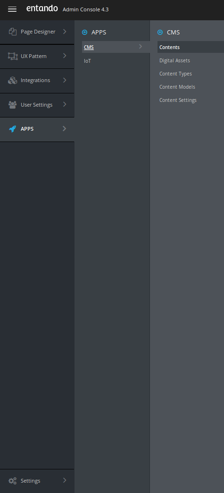
   
   *Figure 45: CMS Menu*

Contents
~~~~~~~~~~~~~~~

In the contents section: you have listed all contents defined in your
Entando instance, (see 
:ref:`figure46`), search functionality is also
available.

Contents are listed in a table that shows the following parameters:

-  Name

-  Author

-  Code

-  Type

-  Status

-  Visibility

-  Group

-  Creation Date

-  Actions

   -  Copy/Paste

   -  Draft version

   -  Published version

   -  Edit

.. _figure46:
.. figure:: media/image49.png
   :scale: 75 %
   :alt: Contents List
   :align: center
   
   *Figure 46: Contents List*

**Add an additional content**

From the Content List view (see 
:ref:`figure47`) by pushing the button Add
can create an additional content; a drop-down list will let you choose
which Content Type, the additional content will instantiate.

.. _figure47:
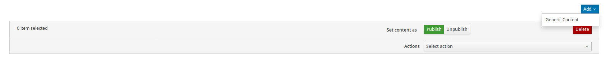
   
   *Figure 47: Add Content*

You will be asked to provide the information for the Content Attributes
that define that Content Type; some of them could be mandatory, it
depends on whether that attribute has been defined mandatory or not.
Then the Content needs to be saved and published to make it available
(see 
:ref:`figure48`).

.. _figure48:
.. figure:: media/image51.png
   :scale: 75 %
   :alt: Filling content type attributes
   :align: center
   
   *Figure 48: Filling content type attributes*

From the Content List, it is also possible to edit a Content (see
:ref:`figure49`). To do that access the Actions Menu of that content and
select the Edit action. The newly added content needs to be saved and
then published to make it available.

.. _figure49:
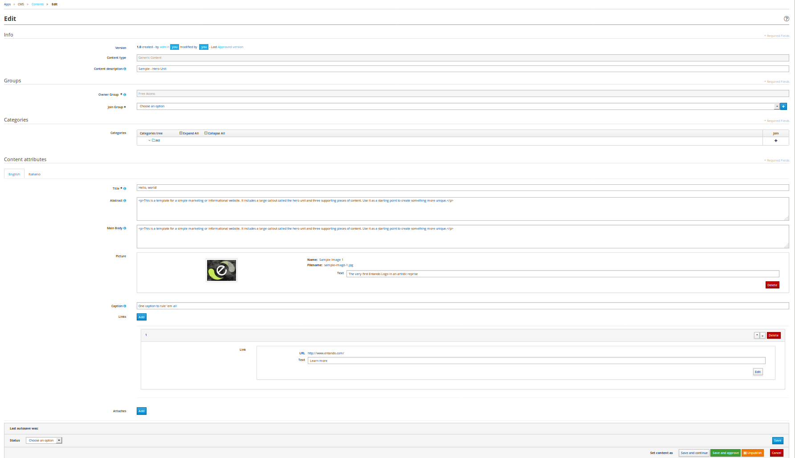
   
   *Figure 49: Content Edit*

.. index::
   single: Digital Assets

Digital Assets
~~~~~~~~~~~~~~~~~~~~~

This subsection provides the functionalities needed to manage Images and
Attachments (see 
:ref:`figure50`).

Images can be any image file of the supported types. Attachment can be
any file type.

New assets can be added by clicking on the Add button. While the
possible actions on an already existing attachment could be Edit and
Delete (see 
:ref:`figure51`)

.. _figure50:
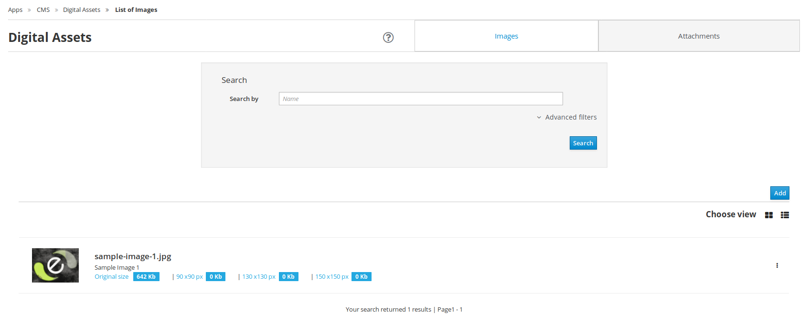
   
   *Figure 50: Digital Assets*

.. _figure51:
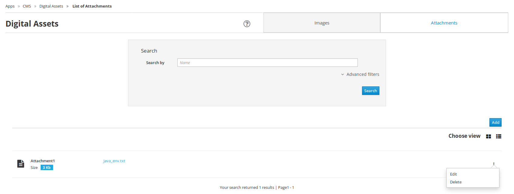
   
   *Figure 51: Digital Assets Actions*

.. index::
   single: Content Types

Content Types
~~~~~~~~~~~~~~~~~~~~~

Content Types are accessible from the Content Types section.

In Content Types we have a list of all the Content Types defined in the
Entando instance (see 
:ref:`figure52`), the table shows:

-  Name

-  Code

-  Status

-  Actions

-  Edit

-  Reload

-  Delete

The available actions in this context are: Edit, Reload, Delete.

From the Edit action you can edit/change the list of all attributes of
that content type.

From Reload, you can reload the configuration.

From delete you can remove that content type from Entando.

You cannot delete a content type if it is used in any content, you need
to delete the contents to which that content type is referred, also in
not possible to change the content type of an already defined content.

.. _figure52:
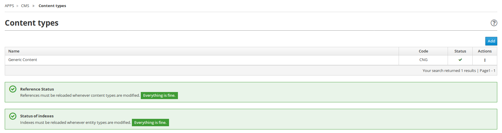
   
   *Figure 52: Content Types List*

 

**Add a Content Type**

The Add button from the Content Type List view, let you add an
additional Content Type, (see 
:ref:`figure53`).

You will be asked to provide:

-  Code (mandatory)

-  Name (mandatory)

-  Attributes (selectable from a drop-down list)

.. _figure53:
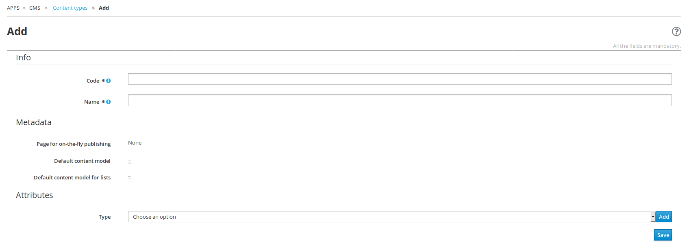
   
   *Figure 53: Add a Content Type*

**Edit a Content Type**

Edit functionalities, (see 
:ref:`figure54`) are available from the three
dots menu.

From there it is possible to change:

-  Name

-  Default Content Model

-  Default Content Model for List

-  Attributes

.. _figure54:
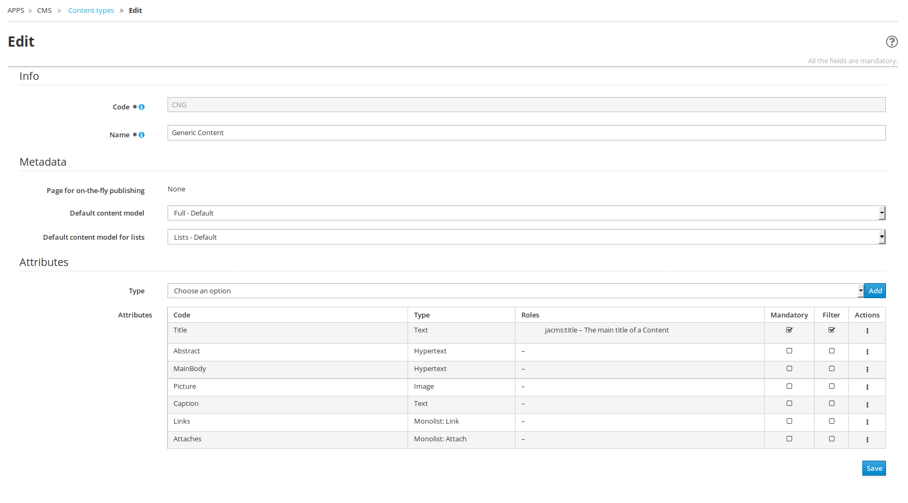
   
   *Figure 54: Edit Content Type*

Content Models
~~~~~~~~~~~~~~~~~~~~~

In the content models section, we get a list of all available Content
Models defined in the Entando instance, (see 
:ref:`figure55`), Contents Models are shown in a table, the following parameters are presented:

-  Name

-  Type

-  Id

-  Actions

   -  Edit

   -  Delete

Available actions are: Edit and Delete (see 
:ref:`figure56`).

From edit (see 
:ref:`figure57`) you get access to the edit section of the
Content Model, from which you can change:

-  Type (from a drop-down list of available Content Types)

-  Name

-  Model (Velocity template)

-  Style Sheet

.. _figure55:
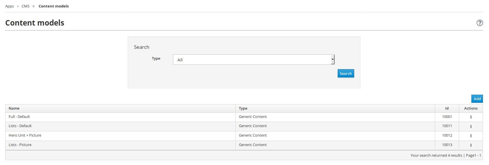
   
   *Figure 55: Content Models List*

.. _figure56:
.. figure:: media/image59.png
   :scale: 75 %
   :alt: Content Model Actions
   :align: center
   
   *Figure 56: Content Model Actions*

.. _figure57:
.. figure:: media/image60.png
   :scale: 75 %
   :alt: Adding/Editing a Content Model
   :align: center
   
   *Figure 57: Adding/Editing a Content Model*

Content Settings
~~~~~~~~~~~~~~~~~~~~~

From Content Settings subsection, (see 
:ref:`figure58`) you can:

-  Reload the references

-  Reload the indexes

-  Select the Editor

.. _figure58:
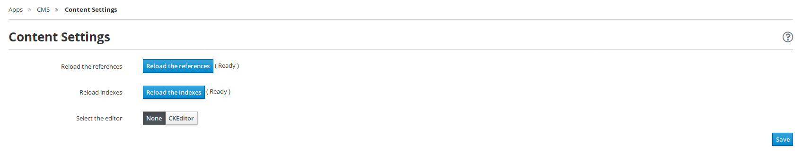
   
   *Figure 58: Content Settings*

.. _settings:

Settings
------------------------------

From this section, (see 
:ref:`figure59`), you can access the Entando general
duty functionalities, such as setting Categories, Labels, Configuration
Reload, Database backup, file browsing and groups management.

-  Settings

   -  Categories

   -  Labels & Languages

   -  Reload Configuration

   -  Database

   -  File Browser

   -  Groups

.. _figure59:
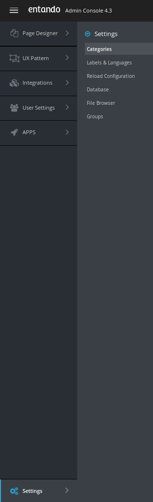
   
   *Figure 59: Settings*

Categories
^^^^^^^^^^^

This subsection shows a list of all available categories (see
:ref:`figure60`) in a tree like structure. For every single category a menu gives you access to the following actions:

-  Details

-  Add

-  Edit

-  Delete

From details (see 
:ref:`figure61`) you get a list of all contents with that
category, in a table with the following columns:

-  Name

-  Code

-  Type

-  Last modified

**Add a Category**

A new category can be added by pushing the Add button, from the main
view or by selecting the Add action from the kebab menu for the selected
category, (see 
:ref:`figure62`).

**Edit a Category**

The parameters of a Category can be edited accessing the Edit action
from the kebab menu (see 
:ref:`figure63`). Note that only the Title can be
changed.

.. _figure60:
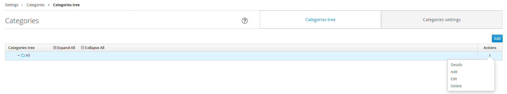
   
   *Figure 60: Categories List*

.. _figure61:
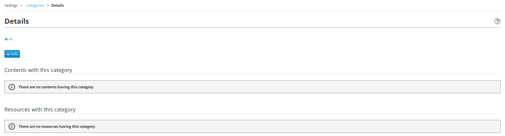
   
   *Figure 61: Category Details*

.. _figure62:
.. figure:: media/image71.png
   :scale: 75 %
   :alt: Add Categories
   :align: center
   
   *Figure 62: Add Categories*

.. _figure63:
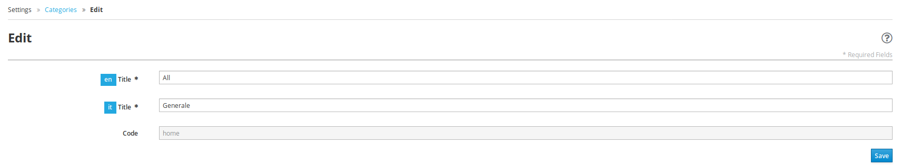
   
   *Figure 63: Edit Categories*

Labels and Languages
^^^^^^^^^^^^^^^^^^^^^

From this subsection you can access Labels and Languages settings, (see
:ref:`figure64`).

The first tab, Languages, shows a list of all configured languages in
the system, information is shown in a table with:

-  Code

-  Name

-  Delete (action, let you delete the selected language)

.. _figure64:
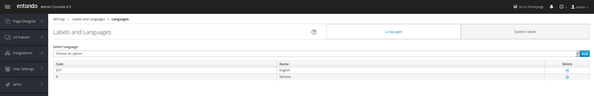
   
   *Figure 64: Label and Languages*

**System labels**

Shows a list of all available system labels, (see
:ref:`figure65`). They are
labels that apply to the entire Entando application.

Are shown in all configured languages, for each language they are
accessible through its tab.

Every single label shows:

-  Code

-  Language

-  Actions (Edit, Delete)

.. _figure65:
.. figure:: media/image74.png
   :scale: 75 %
   :alt: System Labels
   :align: center
   
   *Figure 65: System Labels*

Reload Configuration
^^^^^^^^^^^^^^^^^^^^^

From this section, (see 
:ref:`figure66`), you can reload the Entando
database system configuration.

After successful reloading you will get the following message to confirm
that result:

“\ **Success**! The configuration has been reloaded”.

.. _figure66:
.. figure:: media/image75.png
   :scale: 75 %
   :alt: Reload Configuration Success
   :align: center
   
   *Figure 66: Reload Configuration Success*

Database
^^^^^^^^^^^^^^^^^^^^^

From this section you can back up the entire Entando’s database, by
pushing the “Create Backup” button. The files of the backup are
available from the File Browser section, please refer below, and anyway
present in the file system (see 
:ref:`figure67`). A list of all available
backups is visible in a table with the following information present:

-  Ordinal Number

-  Date

-  Required time

-  Delete option

.. _figure67:
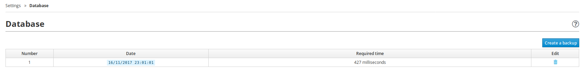
   
   *Figure 67: Database Backup List*

File Browser
^^^^^^^^^^^^^^^^^^^^^

The File Browser subsection (see 
:ref:`figure68`) let you browse files,
upload, create text files and folders in two distinct areas of the
file-system:

-  public: /project\_name/src/main/webapp/resources

-  protected: /project\_name/src/main/webapp/protected

That is specifically useful to make changes to the Entando front-end,
i.e. css, javascript, images.

.. _figure68:
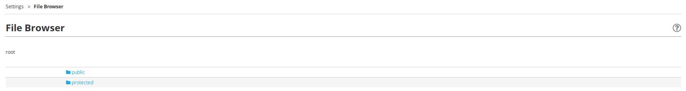
   
   *Figure 68: File Browser*

Groups
^^^^^^^^^^^^^^^^^^^^^

In the Groups subsection you get access to user’s groups management
activities:

in tabled format, (see 
:ref:`figure69`), are listed all the defined User’s
groups, with columns describing:

-  Name

-  Code

-  Actions

A new group can be also added from the provided Add button (see 
:ref:`figure70`).

The possible actions for Groups are:

-  Details

-  Edit

-  Delete

Details, (see
:ref:`figure71`), offer a tabbed view of:

-  Pages

-  Users

-  Widget type

-  Contents

-  Resources

that belong to that Group.

From Edit it is possible to change the name of an existing Group only.

From Delete you can delete the selected group. The Group cannot be
deleted if it has any kind of resource assigned to that Group.

.. _figure69:
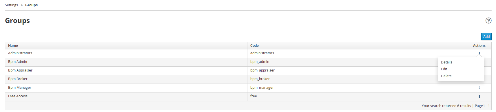
   
   *Figure 69: Groups List and Actions*

.. _figure70:
.. figure:: media/image79.png
   :scale: 75 %
   :alt: Groups Add
   :align: center
   
   *Figure 70: Groups Add*

.. _figure71:
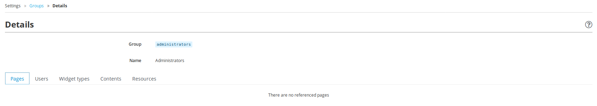
   
   *Figure 71: Groups Details*

.. [1]
   Freemarker is a Java template engine.

