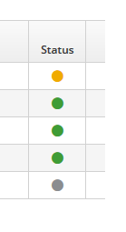

.. _page-management:

***************************************************
Pages and their Management
***************************************************

Pages are fundamental items to build your web application by using the Page Designer.  
The Page Designer is a tool, in the Admin Console, to create, edit and configure Pages.

.. index::
   single: Add new pages

.. _add-new-page:

Add new pages
---------------

This functionality can be accessed from the Page tree view, (see 
:ref:`figure7`), through the Add button; in that case you need to select its
hierarchical placement afterwards. Another way to add a new page is to
select the Add action, for a page, from its kebab menu; in this case
your new page will be a daughter of the selected page.

A page is characterized by the following main paramenters:

* Code (unique identifier of the page)
* Title (description of the page)
* Page Placement (its hierarchical placement)
* Owner Group (the group which owns the page)
* Join Group (additional groups which have access rights on the page)
* Page Model (the model the page implements)
* Other Settings

Let’s describe in some detail how to add a new page:

**Step 1**. Go to Page Designer >> Page Tree

**Step 2**. Decide the hierarchical placement of the page, selecting an
already present page, or you will be asked for that afterwards.

**Step 3**. Provide a title and a code in the Info section, provide
also, selecting them from the dropdown menus, an Owner Group and a Join
Group in the Page groups section, then select a page model from the
available models. Then click “Save and Configure”.

**Step 4**. You will be brought to the configuration section, where are
listed all the frames defined in the page model you associated to that
page. Now you can add the widgets, available on the right-hand side of
the screen, to the page, by dragging and dropping them in the desired
frame, this will be better explained in the “Configure a page” section
below.

**Step 5**. Click on the PUBLISH and then the PREVIEW button to see the modified Page

.. Note::
 A page can be access from the url project-name/en/page-name.page where the project name is the name of the Entando project and the page name is the  name of the page name.
 To make the page accessible from some menu you need to configure it.

Edit a page
-----------------------

This action refers to an already present page. The edit page view is
divided into sections (
:ref:`figure8`):

-  Info

-  Title (title of the page, mandatory)

-  Code (code of the page, assigned automatically, not changeable)

-  Page groups

   -  Owner Group (owner of the page, assigned at creation time, and not
      changeable)

   -  Join Group (group to join, selectable from a drop-down list of
      available groups)

-  Settings

   -  Page Model (the model of the page, mandatory)

   -  Displayed in menu (set whether it must be displayed in menu or
      not, settable to On or Off)

   -  SEO (Search Engine Optimization, set whether it must be optimized
      for Search Engine, settable to On or Off)

   -  Charset (selectable between available charset, i.e. utf8,
      iso-88591)

   -  Mime Type (identifies the type of information, namely text/html,
      application/JSON, and so forth)

Configure a page
-----------------

In the page configuration section, you can assign available widgets to
the frames in the page. The page model defines the available frames or
in other words the page’s layout. The available Widgets are listed from
a Widgets list on the right-hand side of the screen. You can drag
widgets and drop them in a frame of your choice, how it’s showed in the
:ref:`figure9` and 
:ref:`figure10`.

* Click SAVE AND CONFIGURE button.
* Click on the PUBLISH and then the PREVIEW button to see the modified Page.

Add a Content to a page
------------------------

To add an already defined content to a page you need to follow this process:

* select the page where you want to add the content
* identify the frame in which you want to add the new content
* drag and drop the **Contents-Publish a content** widget from the list of available CMS widgets

you will be brought into a page from which you need to:

* choose the content from the list of available contents
* push the confirm button
* change if you need the content model in the publishing  settings section.
* click on the save button
* publish the content
* click on preview button to preview the page

Delete a page
-----------------------

This action removes the page; please note that pages with dependent
pages cannot be deleted.

Page Status
---------------

The page status can be:
:ref:`page-management-figure1`

* draft of an unpublished page (gray bullet)
* online (green bullet)
* draft of an online page (yellow bullet)

.. _page-management-figure1:

   
   *Figure 1: Page Status*

