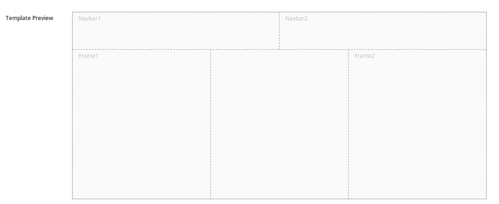

**********************************
Create a new Page Model
**********************************

This activity will complete the creation of a new page model from scratch.

* Select UX Pattern then Page Models from the main menu
* Click the Add button
* Assign a Code and a Name
* Fill the Xml Configuration window with the XML code which defines the page structure
* Fill the Template window with the template Freemarker code which defines the page rendering

**XML Code**

In the XML configuration of a page model are defined all frames which make up the page, each frame has a <frame> tag, with a parameter pos which defines its ordinal position, descr which defines a description and sketch which defines the position and extension of the frame. The coordinate x1 and y1 sets the position of the top left vertex of the frame, while the  coordinate x2 and y2 sets the position of its bottom right vertex. Refer to the code below and to 
:ref:`page-model-figure1` for details.

.. code::

 		<?xml version="1.0" encoding="UTF-8"?>
	<frames>
		<frame pos="0">
			<descr>Navbar1</descr>
		        <sketch x1="0" y1="0" x2="5" y2="0" />
		</frame>
		<frame pos="1">
		 	<descr>Navbar2</descr>
			<sketch x1="6" y1="0" x2="11" y2="0" />
		</frame>
		<frame pos="2">
			<descr>Frame1</descr>
			<sketch x1="0" y1="1" x2="3" y2="4" />
		</frame>
		<frame pos="3">
			<descr>Frame2</descr>
			<sketch x1="8" y1="1" x2="11" y2="4" />
		</frame>
	</frames>

.. _page-model-figure1:

   
   *Figure 1: Page Model Template Preview*

Insert into the template window the following code:

**Template Code**

.. code:: bash

	<#assign wp=JspTaglibs["/aps-core"]>
	<#assign c=JspTaglibs["http://java.sun.com/jsp/jstl/core"]>
	<!DOCTYPE html>
	<html lang="en">
	<head>
	<title>Bootstrap Example</title>
	<meta charset="utf-8">
	<meta name="viewport" content="width=device-width, initial-scale=1">
	<link rel="stylesheet" href="https://maxcdn.bootstrapcdn.com/bootstrap/3.3.7/css/bootstrap.min.css">
	
	
	
	</head>
	<body>

	<nav class="navbar navbar-inverse">
	

	

	<button type="button" class="navbar-toggle" data-toggle="collapse" data-target="#myNavbar">
	
	
	                        
	</button>

	

	

	<ul class="nav navbar-nav navbar-right">
	 **<li><@wp.show frame=0 /></li>**
	  <li><@wp.show frame=1 /></li>
	  </ul>
	

	

	</nav>

	
    
	

	

	
<a href="#">Link</a>

	
<a href="#">Link</a>

	
<a href="#">Link</a>

	

	
 
	<@wp.show frame=2 />
	

	

	

	<@wp.show frame=2 />
	

	

	<@wp.show frame=3 />
	

	

	

	

	<footer class="container-fluid text-center">
	
Footer Text

	</footer>

	</body>
	</html>

* Click on Save

You will be redirected to Page Models list view, which now shows the page model just created.

